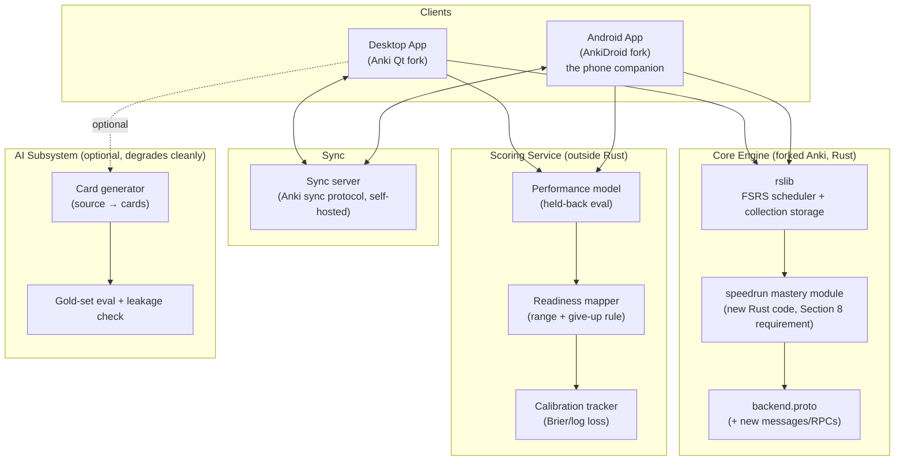

# Speedrun — Architecture

Status: Brainlift v1 complete, both decisions locked (§9 — exam: MCAT, Rust feature: mastery query). Core Engine, Android build, sync, and desktop installer are implemented and verified (see status notes in §3, §4, §5, §10). Scoring Service's give-up gate and Performance model apply-side are implemented on synthetic training data (§6), and the desktop three-score dashboard (§4) shows them live. Still not built: the Readiness mapper, real held-back training data, an Android dashboard, the AI Subsystem, and the §9 thesis ablation.

## 1. Mission → system shape

The PRD asks for three separate, honest scores, not one blended confidence number:

| Score | DOK level | What it answers | Source of truth |
|---|---|---|---|
| Memory | DOK 1 | Can you recall this fact right now? | FSRS (unmodified, from Anki core) |
| Performance | DOK 2/3 | Can you answer a *novel* exam-style question using it? | A trained model, held out of Rust, evaluated against data held back |
| Readiness | DOK 4 | What would you score today, and how sure are we? | A score-mapping function over Performance, with a range and a give-up rule |

That table drives the whole architecture: Memory lives entirely inside the forked Anki engine (don't touch FSRS). Performance and Readiness are new, sit outside the core engine, are individually falsifiable, and must be able to say "I don't know."

## 2. Component diagram



Key constraint from the non-negotiables: **both apps must run fully with AI switched off.** That's why `AI` is drawn as a separate optional subsystem feeding cards into the collection, not something the review loop or the Scoring Service depends on at runtime.

## 3. Core Engine — the forked Anki Rust backend

Fork Anki at the `rslib` / `pylib` / `qt` boundary it already has. Do not reimplement the scheduler.

**What's untouched:** FSRS, card scheduling math, undo, collection storage format (SQLite + protobuf transaction log).

**What's new — the Rust change required by Section 8.** Pick one, sized to the same shape:

| Option | What it does | Risk |
|---|---|---|
| Mastery query | New read-only query: per-topic mastery + average recall, fast on 50k cards, for the dashboard/coverage map | Lowest risk — additive, no scheduling changes |
| Topic-aware scheduling | Reweights due-card order by topic weight × weakness, keeps FSRS intervals/undo valid | Medium — touches the scheduling hot path |
| Points-at-stake queue | New queue ordering + new protobuf message | Medium — new wire format, needs client updates everywhere |

**Recommendation:** mastery query. The dashboard, coverage map, and all three scores need per-topic mastery regardless of which option is picked, it's additive (touches nothing FSRS owns), and it's the one most directly testable with the 3 Rust unit tests + 1 Python test the PRD requires. Confirm against the actual Spiky POV once Brainlift v1 exists — if the thesis is about *scheduling order* rather than *measurement*, topic-aware scheduling is the honest pick instead, and the traceability table should say so.

**Status: implemented.** Lives at `rslib/src/stats/mastery.rs` (not a new top-level `rslib/src/mastery/` as originally sketched — placed alongside `rslib/src/stats/card.rs` and `graphs/` since that's where this codebase's existing query-and-return-a-response-message pattern already lives, and following it turned out to matter more for "how well it fits Anki" than a clean-slate directory would have). Wired through `StatsService.MasteryQuery` in `proto/anki/stats.proto`. Full rationale, the exact files touched, and the undo-safety argument are in [speedrun/docs/rust-change-note.md](speedrun/docs/rust-change-note.md) — that doc is the required one-page note.

- Topic metadata on cards: reuse Anki's existing tag/tagging system rather than a new schema — a `topic::<name>` tag namespace avoids a schema migration and keeps the change small. Confirmed in the implementation: no schema change, just a `tag:topic::<name>` search.
- Confirmed via implementation: Python (pylib) and Kotlin (AnkiDroid) both picked up the generated binding — `GeneratedBackend.kt` exposes `fun masteryQuery(topics: Iterable<String>): List<anki.stats.TopicMastery>`. Reaching Kotlin required building AnkiDroid against a locally-built backend AAR rather than the published one — see §4's build detail and [speedrun/docs/rust-change-note.md](speedrun/docs/rust-change-note.md) for exactly how. The "ships to the phone too" requirement is satisfied.

## 4. Two apps, one engine

- **Desktop** — Anki's existing Qt frontend, extended with the three-score dashboard. Main tool per the PRD. **Status: implemented.** `qt/aqt/speedrun_dashboard.py`, opened with `Ctrl+Shift+D`. Shows Memory (always available, straight from `mastery_query`), Performance (gated by `give_up_gate` — shows the exact review/coverage shortfall when it refuses, a real number when it doesn't), and Readiness (plainly labeled "not yet available" rather than faked, since the Readiness mapper doesn't exist). Built as a native PyQt dialog (`QueryOp` for the background backend call), not a new Svelte page — no dashboard exists on Android yet.
- **Android** — fork AnkiDroid, which already embeds the Rust backend over JNI. Add the same dashboard. This is the phone companion. **Dashboard status: not yet built on this platform** — desktop's dashboard doesn't port automatically since AnkiDroid's UI is a separate Kotlin/Compose codebase.
  - **Important build detail, confirmed by getting it building:** AnkiDroid does not compile the Rust backend from source by default — `gradle/libs.versions.toml` pulls it as a prebuilt Maven artifact (`io.github.david-allison:anki-android-backend`). **Resolved:** `apps/Anki-Android-Backend` is cloned as a sibling to `apps/android` (its own documented local-dev layout), its `anki` submodule points at this fork instead of upstream, and it's built locally via `cargo run -p build_rust` (NDK cross-compile of `rsdroid` to `x86_64-linux-android` via `cargo-ndk`) to produce `rsdroid-release.aar`. `apps/android/local.properties` sets `local_backend=true` so AnkiDroid's Gradle build links that local AAR instead of the Maven one. Full detail, including two small compatibility fixes this required, in [speedrun/docs/rust-change-note.md](speedrun/docs/rust-change-note.md).
- **iOS — explicitly descoped.** No Mac (or cloud Mac CI) is available for this project, and iOS development has no supported path on Windows (no Xcode, no simulator, no on-device signing). The PRD's phone-companion requirement is written in the singular ("the phone") and the grading hard limit ("no phone companion sharing the engine and syncing: 70% maximum") is about having *a* working phone client, not both platforms — so Android alone satisfies it. This gap is stated here and in the Brainlift rather than silently dropped, per the project's own honesty rule.

Both clients talk to the same collection format and the same sync protocol. No client owns its own copy of scheduling logic.

## 5. Sync

Extend Anki's existing sync protocol rather than inventing a new one — it already solves the hard part (usn-based incremental sync of a SQLite collection).

**What syncs:** review log entries (additive, append-only) and topic tags. Mastery is *derived*, not synced — every client recomputes it locally from the review log it already has. This sidesteps a whole class of merge conflicts: you only need a conflict rule for raw review data, never for the derived mastery numbers.

**Conflict rule (must be written down per Section 8) — status: verified against a real desktop client + real AnkiDroid emulator + self-hosted sync server, not just theorized. Full test log and setup in [speedrun/docs/sync-test-results.md](speedrun/docs/sync-test-results.md).**
- Disjoint reviews (10 cards phone-offline, 10 different desktop-offline) → both sets land, nothing is dropped, because review log entries are append-only and keyed by (card, timestamp, device). Confirmed: all 20 cards landed on both clients.
- Same card reviewed on both devices while offline → both review log entries are kept (nothing is silently discarded — that would be an "invented number" by omission), but the card's *next-due* scheduling state is resolved by latest-timestamp-wins, matching Anki's existing usn/mtime conflict handling. Confirmed: both revlog entries survived on both clients; both clients converged to the state dictated by the later-timestamped review.
- Real finding from the test: this only works because both clients shared a synced baseline *before* diverging. If two collections add content independently before ever syncing, the server requires a `FULL_SYNC` (pick one side to win entirely) rather than merging — worth knowing before assuming "just sync" always merges cleanly.

## 6. Scoring Service (outside the Rust core, by design)

Lives outside Rust because it's statistical, needs retraining, and needs to be evaluated on held-back data — none of which belongs in the scheduler.

- **Input:** topic mastery + average recall (from the Core Engine's mastery query), question difficulty, timing, coverage %.
- **Performance model:** predicts accuracy on held-back exam-style questions from those inputs. Calibrated and evaluated with a stated train/test cutoff someone else can rerun. **Status: apply-side implemented, training data is a placeholder.** Split train/apply, same reasoning as the give-up gate: `speedrun/tools/scoring-train/train_performance_model.py` trains a small logistic regression in Python (mastery, difficulty, timing, coverage → predicted accuracy) and serializes the weights; `rslib/src/stats/performance_model.rs` embeds that weights file at compile time and applies it identically on desktop and Android, exposed as `StatsService.PerformanceQuery` — same "one engine" guarantee as `mastery_query`, and it runs the give-up gate first, so nothing here executes for a caller the gate would refuse. **The training data is synthetic** (generated from a fixed seed, clearly labeled in the script) because no real held-back exam-question bank exists yet (§8's "Held-back sets" — not built) — the pipeline is proven rerunnable and beats a majority-class baseline (69% vs 59% on the synthetic eval split), but the resulting weights must not be presented to a real student as a genuine score until retrained on real held-back questions. 4 Rust unit tests + 1 Python test.
- **Readiness mapper:** maps performance distribution → the real exam scale (exam TBD, see §9) with a range, never a single number.
- **Give-up rule:** enforced here, not in the UI — the service itself refuses to emit a score below the stated thresholds (<200 graded reviews or <50% topic coverage), so no client can accidentally bypass it. **Status: implemented.** `StatsService.GiveUpGate` in `rslib/src/stats/give_up_gate.rs` — calls `mastery_query` internally, computes collection-wide graded-review count and topic coverage, and returns a protobuf `oneof` (`data` vs `insufficient`) so there's no code path where a caller can read a score without either passing the gate or being told why not. 3 Rust unit tests + 1 Python test, same pattern as the mastery query. The Performance model and Readiness mapper that would consume the `data` branch are not yet built.
- **Calibration tracking:** Brier score / log loss against held-back reviews, surfaced on the dashboard alongside every score, per the honesty rule.

This service can run as a local process embedded in the desktop/mobile app (no network dependency for the *required* scores) — only the optional AI subsystem needs a network call, keeping "both apps run with AI off" true by construction.

## 7. AI Subsystem (optional, must degrade cleanly)

- Card generation: source → chunking → retrieval → generation → gold-set eval (50 QA pairs, cutoff set before looking) → paraphrase test → leakage check, before anything reaches a student.
- Every AI output must trace to a named source (Section 3 non-negotiable) — store provenance alongside generated cards, not just the card text.
- Must beat a simpler baseline (keyword or vector search) on the held-out eval, or it doesn't ship.
- Failure mode: if the AI service is offline or returns garbage, the app keeps working and keeps scoring — this is why AI is drawn as a side-branch in §2, not on the path from review → score.

## 8. Data model additions (on top of Anki's existing schema)

- `topic` tag namespace on cards (see §3) — no new table needed for basic tagging.
- Exam outline mapping: a data file (versioned in-repo) mapping the official exam outline → topic tags, used for the coverage map and the "abstain below your line" rule.
- Held-back sets: exam-style question bank split into train/eval with a stated, timestamped cutoff — kept out of any AI training/generation context (this is what the leakage checker verifies).
- Gold set: 50 QA pairs for the AI card-quality eval, graded correct-and-useful / wrong / correct-but-bad-teaching.

| Entity | Purpose | Status |
|---|---|---|
| `topic::<name>` tag | Links cards to outline topics | Done — reuses Anki's tag table |
| Exam outline mapping file | Official outline → topic tags, for coverage map | Not built |
| Held-back question bank (train/eval split) | Performance model training + input to leakage check | Not built |
| Gold set (50 QA pairs) | AI card-quality eval | Not built |
| Performance history | Per-topic accuracy on held-back exam-style questions, feeds the Performance model | Not built |
| Readiness prediction log | Each estimate + range + inputs, for the calibration chart (§10.1) | Not built |
| Calibration log | Predicted-vs-actual outcomes, source of Brier/log-loss numbers (§6, §10) | Not built |

## 9. Decisions locked by Brainlift v1

See [speedrun/docs/brainlift.md](speedrun/docs/brainlift.md) for the full research and reasoning behind these.

- **Target exam: MCAT.** Readiness is a scaled score (472–528) with a range, not a pass probability — the branch this would have taken for USMLE doesn't apply. The exam outline mapping (§8) is AAMC's official four-section content list.
- **Rust feature: mastery query** (§3), confirmed rather than overridden — the Brainlift's thesis (POV 1, below) is about *measuring* the recall/transfer gap, not about reordering the review queue, so the lowest-risk, additive option is also the one the thesis actually needs.
- **Thesis feature for Section 9's ablation:** POV 1 — "past a range of card-retention levels, further gains come from transfer training, not more review reps, because isolated flashcard review never trains the discrimination skill exam items require." The three-way build is: (1) full app with a topic-interleaved review mode, (2) same app with that mode off (plain topic-blocked review), (3) unmodified Anki. The paraphrase test (30 cards × 2 rewordings) is the shared measurement across all three, and it's also what POV 1 predicts should show a gap between card-recall accuracy and reworded-question accuracy.
- **Feature flags this implies:** the Core Engine needs the interleaving/blocking toggle on the review queue; the Scoring Service needs to keep the Performance model computable identically regardless of which of the three builds produced the review history feeding it, so the comparison is apples-to-apples.

## 10. Testing & benchmark surface (Section 8/10 requirements → where they live)

### Performance targets (PRD §10, verbatim numbers)

Every row must be reported as p50 / p95 / worst-case on the shared 50k-card deck — a single self-picked number does not satisfy this ("One number you picked yourself does not count."). `speedrun/tools/bench` (not yet built) is the single command that prints all of these.

| Metric | Target | Notes |
|---|---|---|
| Button press acknowledged | p95 < 50ms | Both platforms |
| Next card after grading | p95 < 100ms | |
| Dashboard first load | < 1s | |
| Dashboard refresh | < 500ms | No frozen screen |
| Normal session sync | < 5s | |
| Memory at 50,000 cards | Under a limit we state | Desktop and midrange phone — limit not yet stated |
| Cold start | < 5s desktop, < 4s phone | Nothing blocks the UI over 100ms |
| Crash test | Zero corrupted collections | 20x kill mid-review, each app |

| Requirement | Lives in |
|---|---|
| 3 Rust unit tests + 1 Python test for the Rust change | `core/rslib/src/<module>/tests.rs`, `core/pylib/tests/` |
| Sync test (20 cards, offline/reconnect, conflict rule) | `speedrun/tools/sync-test/` driving two headless client instances against the sync server |
| Coverage map | Derived at runtime from §8's outline mapping; surfaced on dashboard |
| Paraphrase test | `speedrun/tools/paraphrase-test/` — compares recall accuracy vs. reworded-question accuracy |
| Leakage check | `speedrun/tools/leakage-check/` — scans training/generation inputs for held-back eval items |
| AI card check (gold set) | `speedrun/tools/ai-eval/` |
| Crash/offline test (20x kill mid-review) | `speedrun/tools/crash-test/` — scripted kill against both clients, asserts zero corrupted collections |
| Benchmark (`make bench`) | `speedrun/tools/bench/` — loads the 50k-card fixture deck, prints p50/p95/worst-case per Section 10 target |
| Desktop installer (clean-machine run) | `speedrun/docs/desktop-installer.md` — real `.msi` built from this fork's wheels via Briefcase; build verified, install-on-genuinely-separate-machine left to the grader (see doc for what's checked vs. not) |

## 11. Repo layout

This is the actual current layout, not an aspirational sketch. **`core/` (this repo) is the primary submission** — Anki's fork with `rslib`/`pylib`/`qt` mostly untouched, plus everything Speedrun-specific added under `speedrun/` so it's obvious what we added versus what's inherited from upstream Anki:

```
core/                             # this repo — the public Anki fork
├── ARCHITECTURE.md               # this file
├── rslib/src/stats/
│   ├── mastery.rs                # the required Rust change (implemented)
│   ├── give_up_gate.rs           # give-up rule gate (implemented)
│   └── performance_model.rs      # Performance model, apply side (implemented, synthetic training data)
├── proto/anki/stats.proto        # new RPCs/messages for all of the above
├── pylib/anki/collection.py      # thin Python wrappers over the same RPCs
├── qt/installer/                 # desktop installer packaging (Briefcase)
└── speedrun/
    ├── docs/
    │   ├── brainlift.md
    │   ├── rust-change-note.md
    │   ├── sync-test-results.md
    │   ├── desktop-installer.md
    │   └── demo.md                # how to run the demo on both platforms today
    └── tools/
        ├── sync-test/             # drives real desktop + Android clients against the sync server
        └── scoring-train/         # Performance model training script + versioned weights
```

The phone companion is **not** inside this repo — it's two separate public forks:
[speedyrun-android](https://github.com/sohailataiml/speedyrun-android) (AnkiDroid) and
[speedyrun-anki-android-backend](https://github.com/sohailataiml/speedyrun-anki-android-backend)
(the JNI bridge that builds this fork's Rust backend for Android — its `anki` submodule
points at this repo, not upstream Anki). `speedrun/docs/rust-change-note.md` documents
exactly how they're wired together.

Not yet built, so not yet real directories: the Performance model's train-time consumer of real held-back questions (currently synthetic — see `speedrun/tools/scoring-train/`), the Readiness mapper, the AI subsystem, and the `paraphrase-test`/`leakage-check`/`ai-eval`/`crash-test`/`bench` tools listed in §10's table.

## 12. Non-negotiables → architecture mapping

| Non-negotiable (PRD §3) | Where it's enforced |
|---|---|
| Real change inside Anki's Rust code | §3, new module under `core/rslib` |
| Two apps sharing one engine, syncing both ways | §4, §5 |
| Three separate scores, each with a range | §6 — Scoring Service returns a range, never a scalar |
| Models tested on held-back data, rerunnable | §8, §10 — stated cutoffs, `speedrun/tools/` scripts anyone can run |
| Thesis feature testable on/off | §9 — feature-flagged in Core Engine and/or Scoring Service |
| Refuses to score without data | §6 — give-up rule lives in the Scoring Service, not the UI |
| Both apps run with AI off | §7 — AI is a side-branch, never on the score-computation path |
| AGPL v3+, credit to Anki | License file at repo root; retain Anki's existing license headers where forked code is unmodified |
